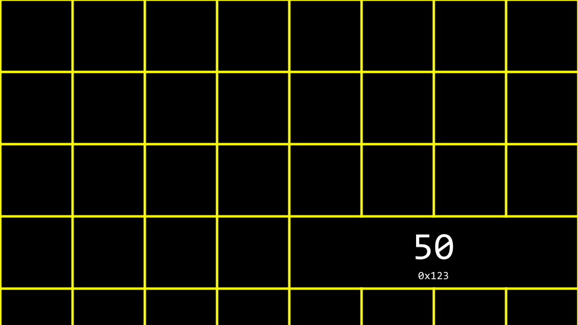
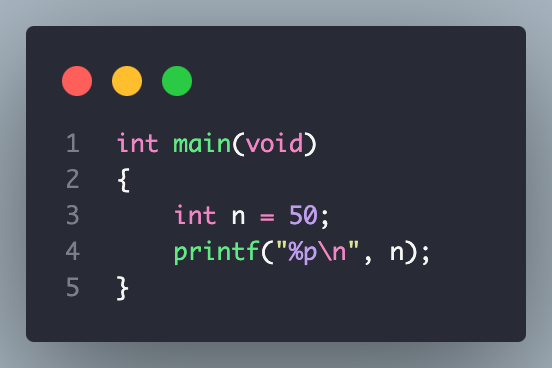

# LECTURE 4 - MEMORY 
### Memory
- **RGB**: red green blue 
### Hexadecimal 
- Hexadecimal is a system of counting that has 16 counting values.
- Hexadecimal is useful because it can be represented using fewer digits. Hexadecimal allows us to represent information more succinctly.
### Addresses
- See the code below \

- How this program stores value n = 50 as follows \

- See the code below \
 \
This above code returns **"the address of a location in memory of n = 50"**
### Pointers 
- A pointer is a variable that contains the address of some value. Most succinctly, a pointer is an address in your computer’s memory.
